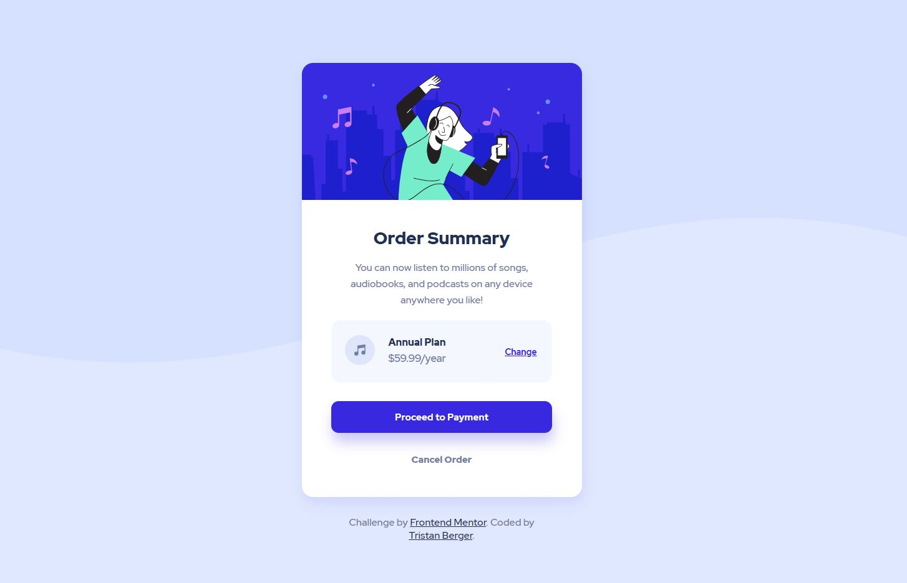

# Frontend Mentor - Order summary card solution

This is a solution to the [Order summary card challenge on Frontend Mentor](https://www.frontendmentor.io/challenges/order-summary-component-QlPmajDUj). Frontend Mentor challenges help you improve your coding skills by building realistic projects. 

## Table of contents

- [Overview](#overview)
  - [The challenge](#the-challenge)
  - [Screenshot](#screenshot)
  - [Links](#links)
- [Author](#author)

## Overview

### The challenge

The challenge is to build an order summary card component and get it look as close to the design as possible.(Reference image are in ./design)
Users should be able to see hover states for interactive elements.

### Screenshots

Screenshots of the current result.

#### Desktop

#### Mobile

### Link 

- [Live site URL here](https://htmlpreview.github.io/?https://github.com/TristanBerger6/FM_order_summary_component/blob/main/index.html)

## Author

- Frontend Mentor - [@TristanBerger6](https://www.frontendmentor.io/profile/TristanBerger6)

